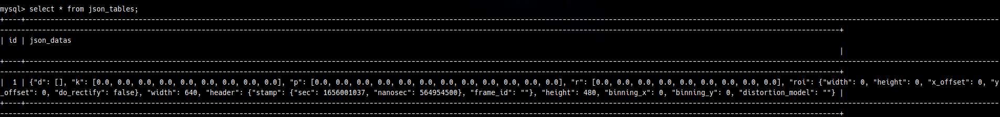
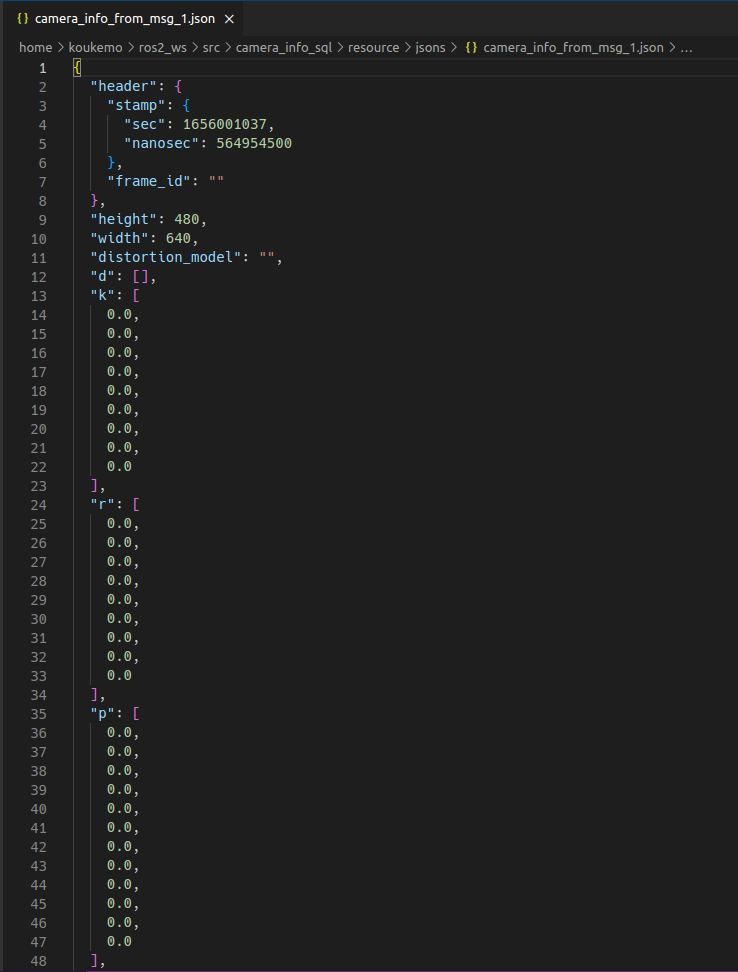

# Camera Info SQL

Sample of saving ros2's camera_info topic in json format to Database.

## Installing

---

- Docker
- Docker Compose
- Python 3.6.x or later is required
    - mysql-connector-python (pip)
- ros2 (The test was done with Humble.)
  - v4l2_camera (webcam information publisher)

## Configurations

---

```
camera_info_sql
├── docs
│   └── figures/
├── db
│   ├── migration/
│   ├── Dockerfile
│   └── docker-compose.yml
├── resource/
│   └── jsons/
└── camera_info_sql
    ├── sql_operations/
    ├── ${Python files for table operations}
    └── camera_info_sql_node.py
```

## Develop settings

---

Run the following command:

Get Repository

```shell
cd ~/ros2_ws/src
git clone git@github.com:koukemo/camera_info_sql.git
```

Building

```shell
cd ~/ros2_ws
colcon build --packages-select camera_info_sql
```


## Tests

---

Run the following command:

Terminal1 (DB)

```shell
cd camera_info_sql/db
docker-compose up
```

Terminal2 (Webcam publisher)

```shell
ros2 run v4l2_camera v4l2_camera_node
```

Terminal3 (Run camera_info_sql)

```shell
cd ~/ros2_ws
. ./install/setup.bash
ros2 run camera_info_sql camera_info_sub
```

## Other Table Operations

### Enter MySQL

With the docker DB container started, run the following: <br>
(The password is set to "test" by default.)

```shell
mysql -h 127.0.0.1 -P 3306 -u test -p
```

### View Table, Data, etc

**View Table Name** <br>

```shell
python3 ~/ros2_ws/src/camera_info_sql/camera_info_sql/show_tables.py
```

**View Table Datas** <br>
default settings | table : 'json_tables', column : '*' <br>
(If you want to change the settings, edit ~/ros2_ws/src/camera_info_sql/camera_info_sql/show_datas.py)

```shell
python3 ~/ros2_ws/src/camera_info_sql/camera_info_sql/show_datas.py
```

<br>

### Delete Data

> **Warning** <br>
> Note that if you do the following, all tables will be empty!

**Delete all data in table** <br>

```shell
python3 ~/ros2_ws/src/camera_info_sql/camera_info_sql/delete_columns.py
```

## Results

---

SQL Content : 



<br>

Json content : 

